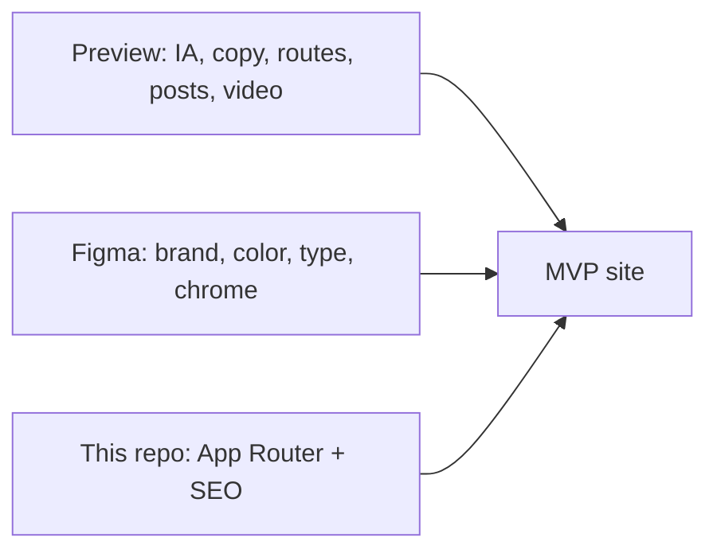
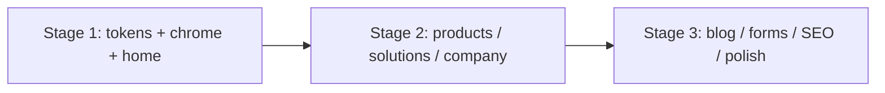

# Roadmap: rebuild OllyGarden in Wicket

Rebuild this Next.js repo so the **first MVP matches the reference app** and **looks like the Awesomic brand**.

Product decision (August 2026): equal the [Pages preview](https://ollygarden-website.pages.dev/) for IA, copy, routes, and behavior. Use the [Awesomic JULY 2026 Figma](https://www.figma.com/design/2Q2qXohp53pJbg6jb2NXHz/Ollygarden---Awesomic--JULY--2026-) for brand only — color, type, logo, iconography, and decorative language (pixel motif, dark forest chrome).

The preview is a Vite SPA (empty HTML shell, no real sitemap or robots). This repo already has App Router, metadata, JSON-LD, sitemap, and OG. The current homepage/copy is a **generic approximation** — replace it. Do not treat it as a source of truth, and do not port its pipeline-style product descriptions.

---

## Sources of truth

| Source | Owns | Does not own |
| --- | --- | --- |
| [Pages preview](https://ollygarden-website.pages.dev/) | Routes, menus, page inventory, copy, forms, blog posts, videos, pricing numbers, section order | Final hex values, typefaces, logo, pixel motif |
| [Figma](https://www.figma.com/design/2Q2qXohp53pJbg6jb2NXHz/Ollygarden---Awesomic--JULY--2026-) **Update 14–15** + **Brand Assets** (style slides) | Color, type, logo, icons, surfaces, spacing language, dark/lime chrome | Homepage copy, extra Figma-only pages, Updates 1–13 |
| This repo | App Router, `createPageMetadata` / `buildPageMetadata`, JSON-LD, sitemap, robots, OG, RSS | Current marketing copy and section layout |

### Conflict rule

When preview and Figma disagree:

1. **Copy, IA, routes, CTAs, section list, pricing, posts** → preview.
2. **Color, type, logo, icons, decorative pattern, chrome** → Figma Brand Assets + Update 14/15 look.
3. **Do not implement Figma-only IA** in this MVP (Press as its own page, podcast/webinars/events/knowledge from the architecture doc, Figma homepage FAQ, Figma hero second CTA). Track them as later.

Worked example: Figma hero is *“Keep your observability backend / Send it better telemetry”* with Get Started + Test Your OTel Knowledge. Preview hero is *“Observability starts with good telemetry”* with a single Get Started CTA. **MVP uses the preview hero.** Apply Figma forest/lime/pixel treatment to that layout.

### Which Figma nodes to use

Pin frames. Do **not** dump page node `2:14` (the whole Updates page, including 13 archived iterations).

| Use | Ignore |
| --- | --- |
| Updates **14** and **15** for visual language on screens that also exist in the preview | Updates **1–13** |
| Brand Assets **style slides** (logo, palette, type, icons) | Brand Assets **Section 1** homepage (*“Make Your Telemetry Pipeline Supercharged”* / *“Check our garden”*) — older home |

---

## Brand tokens

Extract from Figma Brand Assets, then reconcile with the preview CSS. Preview values below are a **starting hypothesis**, not the spec.

| Token | Preview (hypothesis) | Notes |
| --- | --- | --- |
| Background / forest | `#011e0c`, also `#00280e` | Confirm against Brand Assets; earlier pass was ~`#00260f` |
| Lime | `#d9e533` / `#e3e270` | Confirm; do not keep this repo’s `#c8e600` unless Figma matches |
| Olive | `#697d07` | Accents, muted lime |
| Ink | `#0a0f0a` | |
| Panel | `#011407` | |
| Cream / paper | `#faf9f0` | Most-used light surface in the preview CSS — **include it** |
| Display font | Preview: Space Grotesk | Figma Brand Assets references **BDFM**. MVP: use Brand Assets if the file and license are available; otherwise Space Grotesk and record the gap |
| Body | Inter | |
| Code | JetBrains Mono | |

Fonts via `next/font`. Tokens live in `globals.css` / Tailwind 4 `@theme`.

Assets: **export from Figma** (logo, pixel motif, icons, illustrations). Do not redraw SVGs by hand and do not keep the current approximated `PixelPattern`.

---

## Route map

Preview nav: Home · Products · Solutions · Resources · Company · Get Started.

### Real pages in the preview (build these)

| Route | Role |
| --- | --- |
| `/` | Home |
| `/products/insights` | Product + Insights pricing (Free / Essentials / Enterprise) |
| `/products/rose` | Product |
| `/products/tulip` | Product |
| `/solutions/overview` | Solutions hub |
| `/solutions/financial-services` | Vertical |
| `/solutions/retail-ecommerce` | Vertical |
| `/solutions/enterprise-software` | Vertical |
| `/company` | About + Press (preview folds Press into this page) |
| `/careers` | Careers |
| `/contact` | Contact |
| `/resources/blog` | Blog index |
| `/resources/blog/[slug]` | Article (~23 posts in the SPA, not ~15) |

`/company` replaces `/about`. Blog lives at `/resources/blog`, not `/blog`.

### Linked in nav/footer but stubbed in the preview

Keep the links. Do **not** invent full pages. Use a small “coming soon” template. **`noindex`** and omit from `sitemap.ts` until they have real content.

| Route | Preview state | MVP |
| --- | --- | --- |
| `/get-started` | “Full get-started page coming soon” | Stub (or send the header CTA to `/contact` / `/get-started` stub — match preview) |
| `/products/polder` | Mega-menu “Coming soon!” — no Figma frame found | Stub |
| `/resources` | “Full resources page coming soon” | Stub (Docs hub) |
| OTel Quiz | Mega-menu item; no dedicated route (falls through toward `/resources`) | Same as preview: do not add `/quiz` |
| Community | Mega-menu item; no dedicated route | Same as preview |
| Legal: Terms, Rose ToS, Privacy | `href="#"` | Minimal indexable pages **only if** copy exists; otherwise leave as `#` or a one-pager. No Figma-only Ethics/Manifesto |

### Out of MVP (Figma-only IA)

- Standalone Press page (Update 15) — Press stays on `/company`
- Architecture 3.6 extras: podcast, webinars, events, knowledge
- Figma homepage FAQ block
- Second hero CTA “Test Your OTel Knowledge” (quiz stays in the Resources mega-menu)

### SEO redirects (from today’s ollygarden.com / this repo)

| From | To |
| --- | --- |
| `/about` | `/company` |
| `/blog` | `/resources/blog` |
| `/blog/:slug` | `/resources/blog/:slug` if old slugs exist |

---

## How to build (all stages)

- Do not copy the minified SPA CSS/JS. Rebuild in React Server Components + Tailwind, with client islands (`"use client"`) only for menus, forms, and motion.
- Reuse `buildPageMetadata` / JSON-LD / sitemap / OG helpers in `src/lib/seo`.
- **Copy and section order:** preview. **Look:** Figma brand.
- **Videos:** take files from the preview (`/videos/how-ollygarden-works.webm`, Rose demo).
- Replace the current `src/lib/content/*` marketing copy. Insights / Rose / Tulip must match the preview (instrumentation score, AI agent PRs, supported collector) — not generic “pipeline visibility / transform” text.

---

## Stage 1 — System, chrome, and home

**Goal:** the home page *is* the preview home, wearing Figma brand. The rest of the site already navigates in the same shell.

1. Pin Figma Update 14/15 + Brand Assets style slides. Export logo, pixel motif, icons.
2. Design tokens in `globals.css` / Tailwind 4 `@theme` from Brand Assets (forest, lime, cream, type scale, radii, spacing). Fonts via `next/font`.
3. `siteConfig` → OllyGarden from preview (name, description, keywords, social). Tagline: preview hero, not “Send it better telemetry”.
4. Header: logo, mega-menus (Products / Solutions / Resources / Company), Get Started CTA, mobile menu. Menu items and descriptions copy the preview.
5. Footer: 5 columns + social + “Made with ❤️ in Brazil” (country rotation if the preview has it).
6. Home — **preview sections only**, Figma look:
   - Hero: “Observability starts with good telemetry” + single **Get Started** CTA
   - Why / bad telemetry (4 cards: noisy, missing context, PII, unreliable AI)
   - Voices
   - How it works: **Ingest → Analyze → Score → Fix** + Rose / Tulip / Insights
   - Final CTA
7. Home **desktop and mobile**. Figma is mobile-first; do not defer home mobile to Stage 3.
8. Metadata + Organization/WebSite JSON-LD.
9. Redirect `/about` → `/company`. Stub routes may exist so nav does not 404; mark them `noindex`.

**Out of scope for this stage:** hero WebGL canvas, fine parallax, remaining pages, FAQ on home, Figma second hero CTA.

**Done:** desktop + mobile home matches preview structure and Figma brand; nav points at real or stub routes; `npm run build` passes.

---

## Stage 2 — Products, solutions, and company

**Goal:** the full marketing site without a CMS or blog. Layout follows the preview pages; chrome and color follow Figma.

Reusable templates: page hero, bento/cards, how-it-works, pricing, FAQ, CTA band, industry layout.

| Route | Notes |
| --- | --- |
| Insights / Rose / Tulip | Long pages from the preview. Include video/demo **from the preview**. Insights pricing: Free / Essentials ($990/mo) / Enterprise — numbers from preview |
| Polder | Coming-soon stub only |
| Solutions × 4 | Overview + 3 verticals |
| `/company` | About Us; Press lives here (as in the preview), not a separate Figma Press page |
| `/careers` | Preview copy + Figma visual language (Update 14 has a careers frame — use it for look, not extra sections the preview lacks) |
| `/contact` | Build the **page** (preview copy / Figma contact look). Wire the form in Stage 3; Stage 2 can be layout + mailto fallback |

**Done:** each real route has its own metadata, SSR HTML, and a Figma-branded layout (not CSS pasted from the SPA bundle). Stubs stay `noindex`.

---

## Stage 3 — Content, conversion, SEO, and polish

**Goal:** parity with the preview **and** better crawlability than the SPA.

1. **Blog:** port **all posts** from the preview (`/resources/blog` + slugs), RSS, per-article OG. Replace any starter list (e.g. `src/lib/posts.ts`). Use **one** blog listing layout — pick the preview’s, styled with Figma brand (ignore the three Figma listing variants unless product reopens that).
2. **`/contact` and `/get-started`:** forms (client validation; submit via API route, Formspree, or another destination TBD). Keep `/get-started` as a stub until product supplies a real flow.
3. **`/resources`:** Docs hub stub or external docs URL — match preview.
4. **Legal** only if copy exists; otherwise leave footer hashes.
5. **Motion:** only what is needed for preview parity (card hover, mega-menu, voices in-view). Hero canvas / heavy parallax only if product still wants it after visual QA against Figma brand. Do not add Figma-unspecified motion.
6. **SEO on every real route:** `sitemap.ts` (exclude stubs), `robots.ts`, canonicals, redirects, Product/FAQPage/Article JSON-LD, Core Web Vitals.
7. **Responsive** for remaining pages against Figma mobile language (spacing, type, tap targets), not against archived Update frames.

**Done:** preview routes and copy are in Next.js; brand matches Figma; crawlers get HTML, sitemap, and metadata the SPA never had.

---

## Explicit non-goals (MVP)

- Implementing Updates 1–13 or Brand Assets’ old homepage
- Figma architecture extras (podcast, webinars, events, knowledge, ethics)
- Standalone Press page
- Inventing Polder, Quiz, Community, or Docs beyond preview stubs
- Pixel-perfect recreation of every Figma artboard when the preview page does not exist
- Keeping this repo’s current generic product/solution copy
