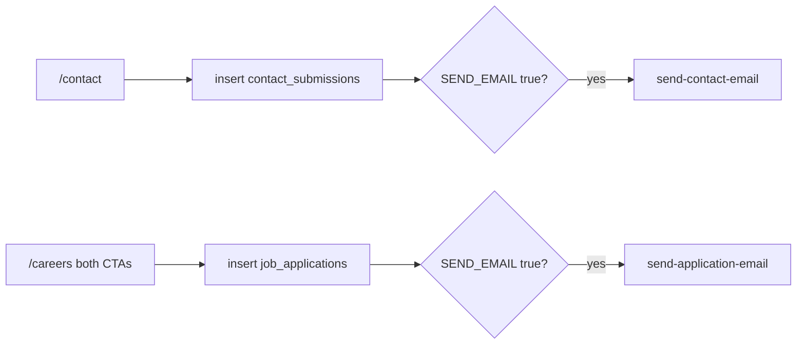

# Supabase

Contact and careers forms submit to the OllyGarden Supabase project. There is no Auth on this site: the browser uses the **publishable** key only. Never put a secret / `service_role` key in this repo.

Env names are Next.js (`NEXT_PUBLIC_*`), not the Vite `VITE_*` names from the previous app.

## Environment

Copy [`.env.example`](../.env.example) and set:

| Variable | Role |
| --- | --- |
| `NEXT_PUBLIC_SUPABASE_URL` | Project URL (`https://….supabase.co`) |
| `NEXT_PUBLIC_SUPABASE_PUBLISHABLE_KEY` | Publishable / anon key |
| `NEXT_PUBLIC_SUPABASE_SEND_EMAIL` | `true` to invoke Edge Functions after insert. Anything else (`false`, unset) **inserts only** — no mail |

Restart `next dev` after changing these. Next inlines `NEXT_PUBLIC_*` at process start.

## Flows

**Contact** ([`src/components/contact-form.tsx`](../src/components/contact-form.tsx)): name, work email, optional message → `contact_submissions` → optional `send-contact-email`.

**Careers** ([`src/components/careers-apply-cta.tsx`](../src/components/careers-apply-cta.tsx)): **Submit Open Application** and **Submit Application** share one modal and one submit path. Fields: full name, email, optional LinkedIn and GitHub → `job_applications` → optional `send-application-email`.

`job_applications.job_id` is NOT NULL in Postgres even though this site has no job listings. Both CTAs send the sentinel `job_id: "open-application"` and `job_title: "Open Application"` ([`src/lib/supabase/submissions.ts`](../src/lib/supabase/submissions.ts)). If that column is a UUID, the insert will fail until product provides a real id.

There is no message field on job applications in the current schema.

## Client

| File | What |
| --- | --- |
| [`src/lib/supabase/client.ts`](../src/lib/supabase/client.ts) | Lazy `createClient`; skips init when URL/key are missing |
| [`src/lib/supabase/submissions.ts`](../src/lib/supabase/submissions.ts) | Insert + gated `functions.invoke` |
| [`src/lib/supabase/types.ts`](../src/lib/supabase/types.ts) | Hand-written `Database` type from the previous app’s insert payloads, not `supabase gen types` |

Package: `@supabase/supabase-js` only. No `@supabase/ssr` (no sessions).

## Local test without mail

1. Set URL + publishable key.
2. Leave `NEXT_PUBLIC_SUPABASE_SEND_EMAIL` as `false`.
3. Submit `/contact` and the careers modal.
4. Check Table Editor: `contact_submissions` and `job_applications`.

When you want the first real notification, set `NEXT_PUBLIC_SUPABASE_SEND_EMAIL=true` and restart. That flag only skips **our** `functions.invoke`. A database trigger or webhook on insert would still fire.

## RLS

The public form uses the publishable key (`anon`). Inserts must be allowed by RLS; `anon` must not be able to `SELECT` other people’s rows. Policy changes live in the Supabase project, not in this repo.
